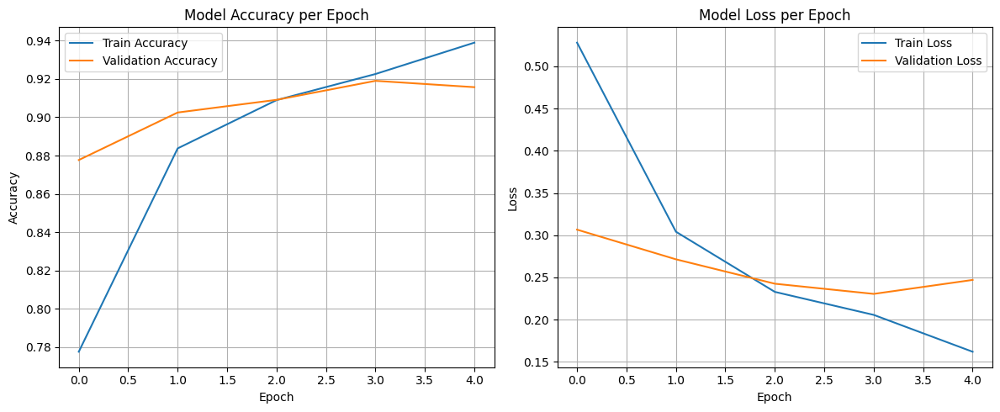
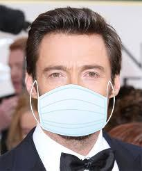

<h1 align="center">😷 Face Mask Detection using CNN</h1>

---

## 📌 Overview

This project uses a **Convolutional Neural Network (CNN)** to detect whether a person is wearing a face mask or not in images. It is trained on a public dataset from Kaggle and achieves high accuracy on test data.

---

## 📂 Dataset

- **Source**: [Kaggle - Face Mask Dataset](https://www.kaggle.com/datasets/omkargurav/face-mask-dataset)
- Contains two categories:
  - `With Mask`
  - `Without Mask`

---

## 🧠 Model Architecture

This project uses a **Convolutional Neural Network (CNN)** built with TensorFlow/Keras to classify face images into two categories: **With Mask** and **Without Mask**.

### 🔍 Layer-by-Layer Description

- **Input Layer**
  - Accepts RGB images of shape `(128, 128, 3)`

- **Convolution Layer 1**
  - `Conv2D(filters=32, kernel_size=(3,3), activation='relu')`
  - Learns low-level features like edges and textures

- **MaxPooling Layer 1**
  - `MaxPooling2D(pool_size=(2,2))`
  - Reduces spatial dimensions to minimize overfitting and computation

- **Convolution Layer 2**
  - `Conv2D(filters=64, kernel_size=(3,3), activation='relu')`
  - Learns more complex spatial features

- **MaxPooling Layer 2**
  - `MaxPooling2D(pool_size=(2,2))`

- **Flatten Layer**
  - `Flatten()`
  - Converts 2D feature maps to 1D feature vector

- **Fully Connected Layer 1**
  - `Dense(units=128, activation='relu')`
  - Followed by `Dropout(0.5)` to reduce overfitting

- **Fully Connected Layer 2**
  - `Dense(units=64, activation='relu')`
  - Followed by another `Dropout(0.5)`

- **Output Layer**
  - `Dense(units=2, activation='sigmoid')`
  - Outputs class probabilities for binary classification

### ⚙️ Compilation Details

- **Loss Function:** `sparse_categorical_crossentropy`  
- **Optimizer:** `Adam`  
- **Evaluation Metric:** `Accuracy`

## ✅ Model Performance

- **Test Accuracy:** 92.79%
- **Precision:** 93.70%
- **Recall:** 91.85%
- **F1 Score:** 92.77%

## 📉 Training and Validation Metrics

The model was trained for 5 epochs. Below is a combined plot showing how the accuracy and loss evolved during training:

- **Left:** Accuracy (Training vs Validation)
- **Right:** Loss (Training vs Validation)

## 🖼️ Sample Predictions

Here are a few sample predictions made by the model:

| Input Image | Model Prediction |
|-------------|------------------|
|  | **1 - With Mask**     |
|  | **0 - Without Mask**  |

> 🎯 Label Explanation:  
> `1 = With Mask`  
> `0 = Without Mask`

## 🛠️ Tools & Technologies Used

This project was built using the following tools and technologies:

- 🧠 **TensorFlow & Keras** — For building and training the CNN model
- 🐍 **Python** — Core programming language
- 🧾 **PIL (Python Imaging Library)** — For image handling 
- 📊 **Matplotlib & Seaborn** — For plotting training metrics and evaluation results
- 📁 **Google Colab** — Development and training environment
- 📦 **Kaggle Datasets API** — For fetching the face mask dataset

## 🛠️ Future Improvements

While the current CNN model achieves good accuracy in mask detection, there are several ways to enhance the project further:

- **Experiment with Advanced Architectures:** Explore state-of-the-art CNN models like ResNet, MobileNet, or EfficientNet to improve accuracy and robustness.
- **Data Augmentation:** Apply techniques such as rotation, zoom, and horizontal flipping to artificially increase the dataset size and reduce overfitting.
- **Real-Time Detection:** Integrate the model with OpenCV or TensorFlow Lite to enable real-time mask detection from webcam or video streams.
- **Multi-Person Detection:** Extend the system to detect masks on multiple people in a single frame.
- **Model Optimization:** Use quantization or pruning to reduce model size and inference time for deployment on edge devices.
- **Expand Dataset:** Include more diverse images covering different ethnicities, lighting conditions, and mask types to improve generalization.
- **Deploy as a Web or Mobile App:** Create an accessible interface for end users to leverage the mask detection system conveniently.

